# Hello! I'm Nazifa Tasnim👋

🎓 Computer Science & Engineering student at BRAC University, Dhaka, Bangladesh

💻 Passionate about problem solving, software development, building projects and research

🧠 Exploring AI/ML & Cybersecurity

🖥️ Interested in 3D Design & Graphics

🚀 Currently strengthening my programming fundamentals and learning new technologies through hands-on projects

📫 Reach me at nazifaoishi11@gmail.com

### 🛠️ Languages & Tools

  

### 🔐 Currently Exploring

    

### 🚀 Featured Projects

<table> <tr> <td width="50%">

### 🐾 Pet Social Platform

A social platform concept designed around pets, adoption, posts and pet communities.

Focus: Web Development • Social Platform • Pet Tech

</td>

<td width="50%">

### 🎨 Areas of Interest

   

⭐ More projects coming soon...

</td> </tr> </table>

### 📊 GitHub Analytics

  
  

### 🔥 Contribution Streak

  

### 📈 Contribution Activity

### 🐍 Contribution Graph

### 🏆 GitHub Trophies

 

### 🎨 Creative & Design Projects

A collection of my work exploring graphic design, digital creativity, 3D design and visual projects.

Focus: Graphic Design • 3D Design • Creative Technology

⭐ More projects coming soon...

  

# ✨ Thanks for visiting my profile!
